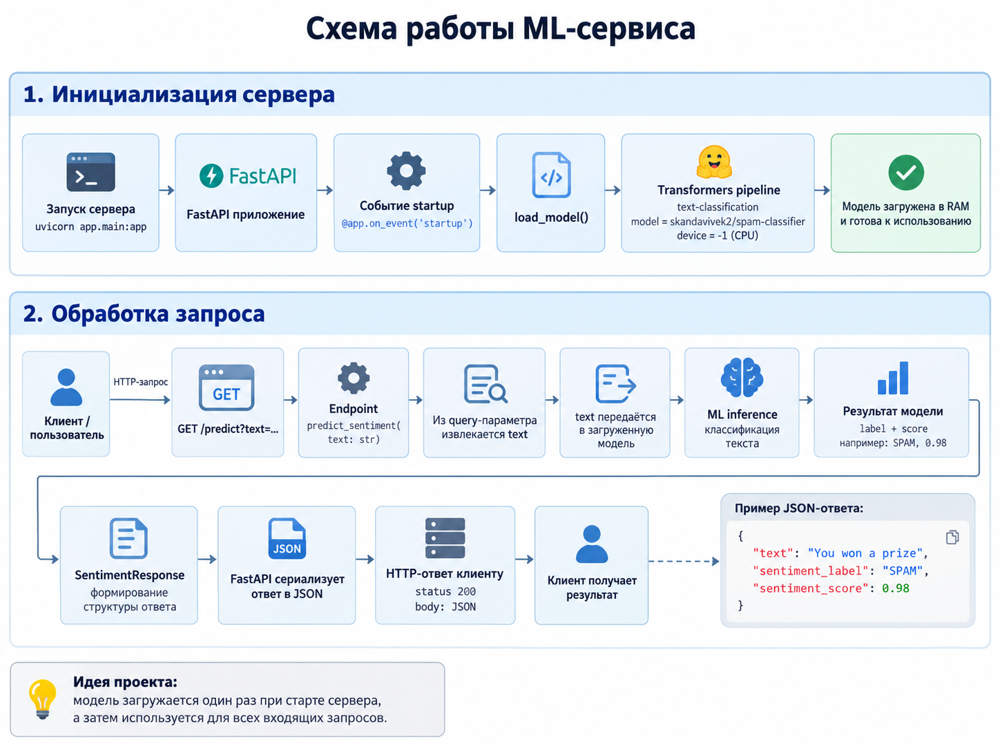

# ML-service

Учебный проект по интеграции предобученной ML-модели в web-сервис.

Основная задача проекта - организовать полный pipeline обработки текста:
от получения HTTP-запроса до передачи текста ML-модели, выполнения inference
и возврата результата клиенту.

Для классификации текста используется предобученная модель
`skandavivek2/spam-classifier` из Hugging Face, определяющая два класса:

- `SPAM` - спам;
- `HAM` - не спам.

## Стек

- Python
- FastAPI
- Uvicorn
- Hugging Face Transformers
- PyTorch
- Pydantic
- Pytest

## Схема работы

<p align="center">
  
</p>

При запуске приложения ML-модель загружается один раз и сохраняется в памяти.
После этого она переиспользуется для обработки последующих запросов.

Основной pipeline:

```text
Клиент -> HTTP GET /predict -> FastAPI -> Transformers pipeline -> ML inference -> SPAM / HAM +score -> JSON -> HTTP-ответ клиенту
```

## Структура проекта

```text
ML-service/
├── app/
│   ├── __init__.py
│   └── fast_api.py
├── ml/
│   ├── __init__.py
│   └── model.py
├── tests/
│   ├── test_ml.py
│   └── test_fastapi.py
├── images/
│   └── schema.png
├── requirements.txt
├── requirements-dev.txt
├── setup.py
└── README.md
```

## ML-модель

В проекте используется готовая предобученная модель:

`skandavivek2/spam-classifier`

Модель подключается через `transformers.pipeline`:

```python
pipeline(
    "text-classification",
    model="skandavivek2/spam-classifier",
    device=-1
)
```

`device=-1` означает выполнение inference на CPU.

Цель проекта заключалась не в обучении собственной модели, а в интеграции
готовой ML-модели в backend-сервис.

## Установка

Установка основных зависимостей:

```bash
pip install -r requirements.txt
```

Установка проекта в editable-режиме:

```bash
pip install -U -e .
```

Для установки инструментов разработки:

```bash
pip install -r requirements-dev.txt
```

## Запуск приложения

Приложение запускается через Uvicorn:

```bash
uvicorn app.fast_api:app --host 127.0.0.1 --port 8080
```

После запуска сервис будет доступен по адресу:

```text
http://127.0.0.1:8080
```

## API

### Проверка работы сервиса

```http
GET /
```

### Классификация текста

```http
GET /predict?text=Your text
```

Пример:

```text
GET /predict?text=You won a prize
```

Пример JSON-ответа:

```json
{
  "text": "You won a prize",
  "sentiment_label": "SPAM",
  "sentiment_score": 0.98
}
```

## Тесты

Тест ML-части:

```bash
pytest tests/test_ml.py
```

Тест API:

```bash
pytest tests/test_fastapi.py
```

`test_ml.py` проверяет непосредственно работу ML-pipeline.

`test_fastapi.py` отправляет HTTP-запрос к запущенному приложению и проверяет
корректность ответа API.
