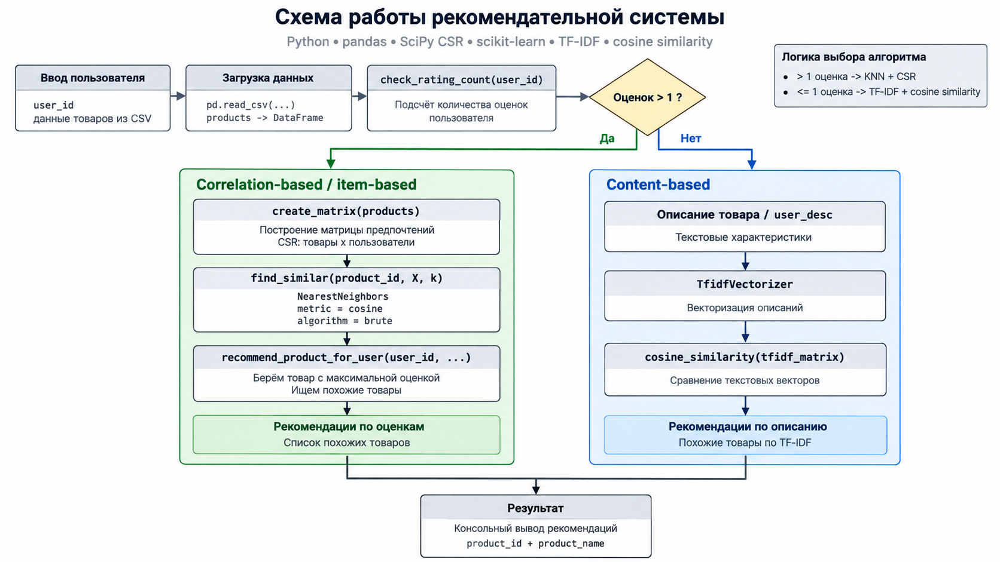

## Описание проекта

Данный проект представляет собой учебную рекомендательную систему для спортивного магазина,
разработанную в рамках курсовой работы по дисциплине  
**«Экспертные и рекомендательные информационно-аналитические системы»**

Цель проекта — изучение и практическая реализация основных подходов к построению
рекомендательных систем, а также демонстрация принципов персонализации рекомендаций
на основе пользовательских предпочтений и характеристик товаров

В условиях большого ассортимента спортивных товаров система помогает сократить время
поиска подходящих товаров, предлагая рекомендации на основе:
- ранее поставленных оценок пользователя
- текстовых описаний товаров
- анализа схожести товаров и предпочтений пользователей

Проект ориентирован на демонстрацию работы алгоритмов рекомендаций и не является
коммерческим продуктом. Реализация выполнена в консольном формате и предназначена
для учебных и исследовательских целей

## Реализация

В зависимости от количества оценок пользователя применяется один из двух подходов:

### Item-based collaborative filtering
- разреженная матрица предпочтений в формате CSR;
- строки — товары, столбцы — пользователи;
- значения — пользовательские оценки;
- поиск похожих товаров через `NearestNeighbors`;
- метрика — cosine distance

### Content-based
- описания товаров преобразуются в TF-IDF-векторы;
- сходство векторов рассчитывается через cosine similarity;
- товары с наиболее похожими описаниями используются для рекомендаций

## Как работает система

  

## TF-IDF

TF-IDF используется для преобразования текстовых описаний товаров в числовые векторы.
Вес слова определяется по формуле:

$$
w_{x,y}=tf_{x,y}\log\left(\frac{N}{df_x}\right)
$$

где:

- $w_{x,y}$ — TF-IDF-вес слова $x$ в документе $y$;
- $tf_{x,y}$ — частота слова $x$ в документе $y$;
- $df_x$ — количество документов, содержащих слово $x$;
- $N$ — общее количество документов

Чем чаще слово встречается в конкретном описании и чем реже оно встречается
в остальных описаниях, тем больше его вес

## Cosine similarity

Для сравнения полученных векторов используется косинусное сходство:

$$
\cos(\theta)=\frac{A\cdot B}{\|A\|\|B\|}
$$

где:

- $A$ и $B$ — сравниваемые векторы;
- $A\cdot B$ — скалярное произведение векторов;
- $\|A\|$ и $\|B\|$ — длины векторов;
- $\theta$ — угол между векторами

Чем ближе значение cosine similarity к `1`, тем более похожими являются векторы
и, соответственно, описания товаров
